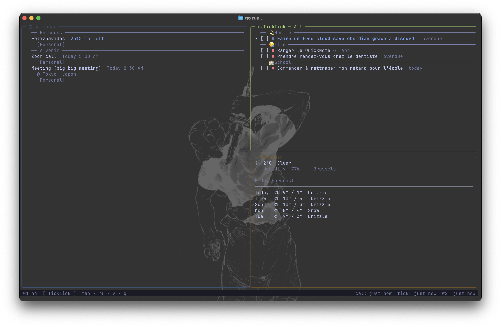

# daash

Personal life dashboard in the terminal, built with [Bubble Tea](https://github.com/charmbracelet/bubbletea) and [Lipgloss](https://github.com/charmbracelet/lipgloss). Inspired by btop, Tokyo Night color palette.

## Panels



- **Calendar** — Google Calendar events for the next 30 days. Ongoing events appear in a separate section with time remaining highlighted in blue. Auto-refreshes every 5 minutes.
- **TickTick** — Tasks from configured projects, with Today / 7 Days / All filter modes. Recurring tasks are marked with `↻`. Auto-refreshes every 10 minutes.
- **Weather** — Current weather and 5-day forecast via [Open-Meteo](https://open-meteo.com/) (no API key needed). City configurable.

## Requirements

- Go 1.21+
- macOS or Linux (Windows not supported yet)
- A Google account with the Calendar API enabled
- A TickTick developer app (free, see setup below)
- A [Nerd Font](https://www.nerdfonts.com/) installed and set in your terminal (for icons)

## Setup

### 1. Google Calendar API

1. Go to [Google Cloud Console](https://console.cloud.google.com/)
2. Create a project and enable the **Google Calendar API**
3. Create OAuth 2.0 credentials (type: Desktop app)
4. Add `http://localhost:8085` as an authorized redirect URI
5. Copy the `client_id` and `client_secret` into `config.yaml` (see step 3)

### 2. TickTick API

1. Go to [developer.ticktick.com/manage](https://developer.ticktick.com/manage)
2. Create a new app
3. Set the OAuth redirect URL to `http://localhost:8086`
4. Copy the `client_id` and `client_secret`

### 3. Config file

Create `~/.config/daash/config.yaml`:

```yaml
google:
  client_id: "your_google_client_id"
  client_secret: "your_google_client_secret"

calendars:
  - id: "your.email@gmail.com"
    name: "Personal"
  - id: "abc123@group.calendar.google.com"
    name: "Work"

ticktick:
  client_id: "your_client_id"
  client_secret: "your_client_secret"
  all_projects: true  # fetch all projects automatically (archived ones are excluded)

# or pick projects manually (all_projects: false or omitted):
# ticktick:
#   client_id: "your_client_id"
#   client_secret: "your_client_secret"
#   projects:
#     - id: "abc123"
#       name: "Life"
#     - id: "def456"
#       name: "Work"

weather:
  city: "Brussels"  # any city name works, e.g. "Paris", "Tokyo", "New York"
```

To find your IDs:

```bash
./daash --list-calendars           # Google Calendar IDs
./daash --list-ticktick-projects   # TickTick project IDs
```

The `weather.city` field defaults to `Brussels` if omitted.

### 4. Authentication

On first launch, the browser opens for OAuth authorization (Google Calendar first, then TickTick). Tokens are cached and reused automatically.

## Installation

```bash
git clone ...
cd daash
go build -o daash .
./daash
```

## Usage

```
./daash                          # launch the dashboard
./daash --list-calendars         # list available Google calendars
./daash --list-ticktick-projects # list available TickTick projects
./daash --help                   # show help
```

### Keybindings

| Key            | Action                                       |
| -------------- | -------------------------------------------- |
| `Tab`          | Focus next panel                             |
| `Shift+Tab`    | Focus previous panel                         |
| `↑` / `k`      | Scroll up                                    |
| `↓` / `j`      | Scroll down                                  |
| `v`            | Cycle TickTick filter (Today / 7 Days / All) |
| `r`            | Force refresh (Calendar + TickTick)          |
| `q` / `Ctrl+C` | Quit                                         |

## Important files

```
~/.config/daash/config.yaml         # all credentials and settings
~/.config/daash/token.json          # Google OAuth token (auto-generated)
~/.config/daash/ticktick_token.json # TickTick OAuth token (auto-generated)
```
